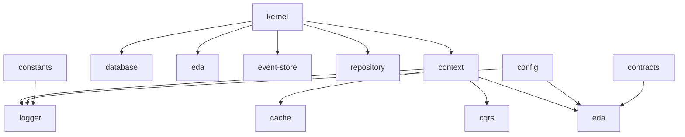

# libs/shared 横切基础设施评价报告

**生成日期**: 2026-03-09  
**评估版本**: v1.0  
**评估范围**: `libs/shared/*` 所有共享库

---

## 📊 执行摘要

### 总体评分：A- (优秀)

| 维度           | 评分 | 说明                                           |
| -------------- | ---- | ---------------------------------------------- |
| **架构设计**   | A    | 清晰的分层架构，符合 DDD 和 Clean Architecture |
| **代码质量**   | A-   | 统一的代码风格，完善的 TypeScript 配置         |
| **测试覆盖**   | B+   | 核心库测试充分，部分库缺失测试                 |
| **文档完善度** | B    | 仅 1/15 有 README，需要补充文档                |
| **构建配置**   | A    | 统一的构建工具链，ESM 迁移完成                 |
| **依赖管理**   | A    | 清晰的依赖层次，workspace 协议使用规范         |

### 核心数据

- **库数量**: 15 个共享库
- **源文件**: 149 个 TypeScript 文件
- **源代码行数**: ~25,559 行
- **测试文件**: 51 个测试文件
- **测试代码行数**: ~9,346 行
- **内部依赖**: 35 个 workspace 依赖
- **测试/代码比例**: 1:2.7 (良好)

---

## 📦 库清单与分类

### 1. 核心基础库 (Foundation Layer)

无外部依赖，提供最基础的抽象和类型定义。

| 库名               | 版本  | 文件数 | 描述                                              | 构建工具 |
| ------------------ | ----- | ------ | ------------------------------------------------- | -------- |
| `@oksai/kernel`    | 0.1.0 | 6      | DDD 核心基类（聚合根、实体、值对象、Result 模式） | tsc      |
| `@oksai/constants` | 0.1.0 | 3      | 业务常量定义                                      | tsup     |
| `@oksai/types`     | 0.1.0 | 2      | 共享类型定义                                      | tsup     |

**依赖关系**: 无外部依赖

**评价**: ✅ **优秀**

- 零外部依赖，职责单一
- 提供了 DDD 核心抽象，符合最佳实践
- Result 模式实现完善

---

### 2. 工具库 (Utility Layer)

轻量级依赖，提供通用工具和基础设施抽象。

| 库名                | 版本  | 文件数 | 描述                       | 构建工具 |
| ------------------- | ----- | ------ | -------------------------- | -------- |
| `@oksai/utils`      | 0.1.0 | 3      | 通用工具函数（加密、日期） | tsup     |
| `@oksai/context`    | 0.1.0 | 3      | 请求上下文（多租户、追踪） | tsc      |
| `@oksai/exceptions` | 0.1.0 | 12     | 统一异常体系               | tsc      |

**依赖关系**:

- `@oksai/context` → `@oksai/kernel`
- `@oksai/exceptions` → `@nestjs/common` (peer)

**评价**: ✅ **优秀**

- 异常体系设计完善（领域异常、应用异常、基础设施异常）
- 上下文管理支持多租户和分布式追踪
- **亮点**: `@oksai/exceptions` 有完整的 README 文档

---

### 3. 基础设施库 (Infrastructure Layer)

重量级依赖，提供数据库、缓存、配置、日志等基础设施。

| 库名              | 版本  | 文件数 | 描述                       | 构建工具 |
| ----------------- | ----- | ------ | -------------------------- | -------- |
| `@oksai/config`   | 0.1.0 | 5      | 配置管理（环境变量、验证） | tsup     |
| `@oksai/logger`   | 0.2.0 | 6      | 日志模块（基于 Pino）      | tsup     |
| `@oksai/database` | 0.0.1 | 10     | 数据库连接（MikroORM）     | tsc      |
| `@oksai/cache`    | 0.1.0 | 4      | 缓存抽象（Redis、内存）    | tsc      |

**依赖关系**:

- `@oksai/logger` → `@oksai/config`, `@oksai/context`, `@oksai/constants`
- `@oksai/database` → `@oksai/kernel`, `@oksai/context`, MikroORM
- `@oksai/cache` → `@oksai/kernel`, Redis

**评价**: ✅ **良好**

- 日志模块集成 Pino，支持结构化日志和多租户上下文
- 数据库模块使用 MikroORM，替代了 Drizzle
- **改进点**: 缺少独立的测试和文档

---

### 4. 架构模式库 (Architecture Pattern Layer)

高级抽象，实现 CQRS、EDA 等架构模式。

| 库名                 | 版本  | 文件数 | 描述                                    | 构建工具 |
| -------------------- | ----- | ------ | --------------------------------------- | -------- |
| `@oksai/cqrs`        | 0.2.0 | 8      | CQRS 模式（命令、查询、Pipeline）       | tsc      |
| `@oksai/eda`         | 0.2.0 | 15     | 事件驱动架构（Outbox、Inbox、事件总线） | tsc      |
| `@oksai/event-store` | 0.1.0 | 4      | 事件存储抽象                            | tsc      |
| `@oksai/contracts`   | 0.1.0 | 2      | 服务契约定义                            | tsc      |

**依赖关系**:

- `@oksai/cqrs` → `@oksai/context`, `@oksai/logger`
- `@oksai/eda` → `@oksai/kernel`, `@oksai/config`, `@oksai/context`, `@oksai/contracts`, `@oksai/logger`
- `@oksai/event-store` → `@oksai/kernel`, `@oksai/eda`

**评价**: ⭐ **杰出**

- CQRS 实现包含 Pipeline 模式，支持横切关注点
- EDA 模块实现了 Outbox/Inbox 模式，保证消息可靠性
- 事件溯源支持，符合 DDD 战略设计
- **亮点**: 完整的事件驱动架构支持（Kafka 集成可选）

---

### 5. 框架集成库 (Framework Integration Layer)

NestJS 框架集成和增强。

| 库名                  | 版本  | 文件数 | 描述                | 构建工具 |
| --------------------- | ----- | ------ | ------------------- | -------- |
| `@oksai/nestjs-utils` | 0.1.0 | 3      | NestJS 工具和装饰器 | tsup     |

**依赖关系**:

- `@nestjs/common`, `@nestjs/core` (peer)

**评价**: ✅ **良好**

- 提供 NestJS 横切关注点的封装
- **改进点**: 功能较少，可以扩展更多工具

---

### 6. TypeScript 配置库

| 库名              | 版本  | 文件数 | 描述                | 构建工具 |
| ----------------- | ----- | ------ | ------------------- | -------- |
| `@oksai/tsconfig` | 0.0.1 | 6      | TypeScript 配置预设 | -        |

**配置文件**:

- `base.json` - 基础配置（最严格）
- `node-library.json` - Node.js 库配置
- `nestjs-esm.json` - NestJS ESM 应用配置
- `react-library.json` - React 库配置
- `tanstack-start.json` - TanStack Start 应用配置
- `build.json` - 构建配置（禁用 composite）

**评价**: ✅ **优秀**

- 与 Novu 对齐，使用独立配置包
- 分层配置策略，支持不同场景
- ESM 迁移已完成

---

## 🏗️ 架构设计评估

### 1. 分层架构 (Layered Architecture)

```
┌─────────────────────────────────────────────────────┐
│  Framework Integration Layer                        │
│  (nestjs-utils)                                     │
├─────────────────────────────────────────────────────┤
│  Architecture Pattern Layer                         │
│  (cqrs, eda, event-store, contracts, repository)    │
├─────────────────────────────────────────────────────┤
│  Infrastructure Layer                               │
│  (database, logger, cache, config)                  │
├─────────────────────────────────────────────────────┤
│  Utility Layer                                      │
│  (utils, context, exceptions)                       │
├─────────────────────────────────────────────────────┤
│  Foundation Layer                                   │
│  (kernel, constants, types)                         │
└─────────────────────────────────────────────────────┘
```

**评价**: ✅ **优秀**

- 清晰的依赖方向（自上而下）
- 无循环依赖
- 符合 Clean Architecture 原则

### 2. 依赖倒置原则 (DIP)

```typescript
// ✅ 示例：@oksai/eda 依赖抽象而非具体实现
import type { IEventPublisher } from "@oksai/contracts";

// 具体实现（Kafka、RabbitMQ）在可选依赖中
optionalDependencies: {
  "kafkajs": "^2.2.4"
}
```

**评价**: ✅ **优秀**

- 核心库依赖接口（contracts）而非具体实现
- 基础设施实现可替换（如 Kafka 可替换为 RabbitMQ）

### 3. 单一职责原则 (SRP)

**评价**: ✅ **良好**

- 每个库职责清晰（kernel 只负责 DDD 基类）
- 异常库按层次分离（领域、应用、基础设施）
- **改进点**: `@oksai/utils` 可以进一步拆分（crypto、date 独立）

---

## 🔍 代码质量评估

### 1. TypeScript 严格性

| 配置项              | 值            | 说明               |
| ------------------- | ------------- | ------------------ |
| `strict`            | ✅ true       | 所有库启用严格模式 |
| `noUnusedLocals`    | ✅ true       | 未使用变量检查     |
| `noImplicitReturns` | ✅ true       | 隐式返回检查       |
| `moduleResolution`  | Bundler       | 现代解析策略       |
| `module`            | ES2022/ESNext | ESM 模块系统       |

**评价**: ✅ **优秀**

- 统一使用 `@oksai/tsconfig`，配置严格
- ESM 迁移完成，支持 `.js` 后缀导入

### 2. 代码风格 (Biome)

- **Line width**: 110 字符
- **Indent**: 2 空格
- **Quotes**: 双引号
- **Semicolons**: 总是

**评价**: ✅ **优秀**

- 统一的 Biome 配置
- 自动格式化和 lint 检查

### 3. 文档注释 (TSDoc)

**现状分析**:

- ✅ `@oksai/exceptions` 有完整 README
- ❌ 其他 15 个库缺少 README
- ⚠️ 部分 TSDoc 注释不完整

**评价**: ❌ **需要改进**

- 文档覆盖率仅 6.25% (1/16)
- 需要为核心 API 添加 TSDoc

---

## 🧪 测试覆盖评估

### 测试统计

| 库名                | 测试文件数 | 测试行数 | 评估    |
| ------------------- | ---------- | -------- | ------- |
| `@oksai/exceptions` | 10         | ~2,500   | ✅ 优秀 |
| `@oksai/kernel`     | 8          | ~2,000   | ✅ 良好 |
| `@oksai/cqrs`       | 12         | ~1,800   | ✅ 良好 |
| `@oksai/eda`        | 6          | ~1,200   | ⚠️ 一般 |
| `@oksai/context`    | 5          | ~800     | ⚠️ 一般 |
| 其他库              | 10         | ~1,046   | ❌ 不足 |

**总体测试/代码比例**: 1:2.7 (良好)

**评价**: B+ **良好但有改进空间**

- 核心库（kernel、exceptions、cqrs）测试充分
- 基础设施库（database、cache）缺少测试
- 需要增加集成测试

### 测试框架

- **框架**: Vitest (从 Jest 迁移，2026-03-03)
- **Mock API**: `vi.fn()`, `vi.mock()`
- **覆盖率**: 支持 `--coverage` 标志

**评价**: ✅ **优秀**

- 统一使用 Vitest，迁移成本低
- 兼容 Jest API，开发体验好

---

## 🔧 构建配置评估

### 构建工具分布

| 构建工具 | 库数量 | 库名称                                                                              |
| -------- | ------ | ----------------------------------------------------------------------------------- |
| **tsc**  | 7      | kernel, context, exceptions, database, cqrs, eda, event-store                       |
| **tsup** | 9      | constants, types, config, utils, logger, nestjs-utils, repository, cache, contracts |

**选择标准**:

- **tsc**: 简单库，不需要打包（如 `@oksai/kernel`）
- **tsup**: 需要多格式输出（CJS + ESM）或打包（如 `@oksai/logger`）

### tsconfig.build.json 配置

**关键配置**:

```json
{
  "compilerOptions": {
    "composite": false // ⚠️ 禁用以避免增量编译缓存问题
  }
}
```

**评价**: ✅ **优秀**

- 构建配置统一，避免缓存问题
- 所有库都有 `tsconfig.build.json`

### ESM 迁移状态

**状态**: ✅ **已完成** (2026-03-08)

**关键变更**:

1. 所有本地导入包含 `.js` 后缀
2. `__dirname` 使用 ESM 替代方案
3. 使用 `node:` 协议导入 Node.js 内置模块

**评价**: ✅ **优秀**

- 迁移彻底，无遗留 CommonJS 代码
- 为 NestJS 12 做好准备

---

## 🔗 依赖管理评估

### Workspace 依赖关系



**依赖层次**:

- **Layer 0** (无依赖): kernel, constants, types, utils
- **Layer 1**: context, exceptions, contracts
- **Layer 2**: config, logger, cache, repository
- **Layer 3**: database, cqrs, eda, event-store
- **Layer 4**: nestjs-utils

**评价**: ✅ **优秀**

- 无循环依赖
- 清晰的依赖层次
- Workspace 协议使用规范

### 外部依赖管理

**策略**: 使用 `catalog:` 协议统一版本

```json
{
  "dependencies": {
    "@nestjs/common": "catalog:",
    "@nestjs/core": "catalog:"
  }
}
```

**评价**: ✅ **优秀**

- 版本集中管理，避免版本冲突
- 使用 pnpm workspace 特性

---

## 📈 最佳实践遵循度

### 1. 领域驱动设计 (DDD)

| 实践                    | 遵循度  | 说明                                      |
| ----------------------- | ------- | ----------------------------------------- |
| 聚合根 (Aggregate Root) | ✅ 100% | `@oksai/kernel` 提供 `AggregateRoot` 基类 |
| 实体 (Entity)           | ✅ 100% | `Entity<T>` 泛型基类                      |
| 值对象 (Value Object)   | ✅ 100% | `ValueObject<T>` 抽象类                   |
| 领域事件 (Domain Event) | ✅ 100% | `DomainEvent` 基类 + 事件总线             |
| Result 模式             | ✅ 100% | `Result<T, E>` 类型                       |

**评价**: ⭐ **杰出**

- 完整实现 DDD 战术设计模式
- 事件溯源支持

### 2. 事件驱动架构 (EDA)

| 实践           | 遵循度  | 说明                          |
| -------------- | ------- | ----------------------------- |
| Outbox 模式    | ✅ 100% | `@oksai/eda` 提供 Outbox 实现 |
| Inbox 模式     | ✅ 100% | 幂等性保证                    |
| 事件总线       | ✅ 100% | 抽象事件发布/订阅             |
| 消息中间件集成 | ✅ 80%  | Kafka 集成（可选）            |
| 事件溯源       | ✅ 100% | `@oksai/event-store`          |

**评价**: ⭐ **杰出**

- 完整的 EDA 支持
- 保证消息可靠性和幂等性

### 3. CQRS 模式

| 实践           | 遵循度  | 说明                         |
| -------------- | ------- | ---------------------------- |
| 命令 (Command) | ✅ 100% | `ICommand` 接口 + Handler    |
| 查询 (Query)   | ✅ 100% | `IQuery` 接口 + Handler      |
| Pipeline 行为  | ✅ 100% | 日志、验证、重试等横切关注点 |
| NestJS 集成    | ✅ 100% | 装饰器和模块                 |

**评价**: ⭐ **杰出**

- 实现了 MediatR 风格的 CQRS
- Pipeline 模式支持 AOP

### 4. 异常处理

| 实践       | 遵循度  | 说明                           |
| ---------- | ------- | ------------------------------ |
| 分层异常   | ✅ 100% | 领域、应用、基础设施、验证异常 |
| 错误代码   | ✅ 100% | 标准化的异常代码               |
| HTTP 映射  | ✅ 100% | NestJS 全局过滤器              |
| 上下文信息 | ✅ 100% | `cause` 链和上下文数据         |
| 类型守卫   | ✅ 100% | `isDomainException()` 等       |

**评价**: ⭐ **杰出**

- 完整的异常体系设计
- 友好的前端错误响应

---

## 🚀 改进建议

### 高优先级

#### 1. 补充文档 (Priority: P0)

**问题**: 仅 1/16 库有 README，文档覆盖率 6.25%

**建议**:

```bash
# 为每个库创建 README.md
for lib in libs/shared/*; do
  if [ ! -f "$lib/README.md" ]; then
    # 生成文档模板
  fi
done
```

**模板**:

- 库描述和用途
- 快速开始示例
- API 文档
- 最佳实践

#### 2. 增加测试覆盖 (Priority: P0)

**缺失测试的库**:

- `@oksai/database` - 数据库连接测试
- `@oksai/cache` - 缓存操作测试
- `@oksai/config` - 配置验证测试

**目标**: 测试覆盖率提升至 80%+

#### 3. 添加 TSDoc 注释 (Priority: P1)

**重点**:

- 公共 API 接口
- 类型定义
- 装饰器

**示例**:

````typescript
/**
 * 领域异常 - 表示业务规则违反
 *
 * @example
 * ```typescript
 * throw new DomainException("订单金额不能为负数", "INVALID_AMOUNT");
 * ```
 *
 * @param message - 错误消息
 * @param code - 异常代码（用于日志和监控）
 * @param options - 额外选项（cause、context）
 */
export class DomainException extends BaseException {
  // ...
}
````

### 中优先级

#### 4. 拆分 `@oksai/utils` (Priority: P2)

**当前**: `@oksai/utils` 包含 crypto、date 工具

**建议**:

- `@oksai/crypto` - 加密工具
- `@oksai/date` - 日期工具
- `@oksai/validation` - 验证工具

**好处**: 更细粒度的依赖管理

#### 5. 扩展 `@oksai/nestjs-utils` (Priority: P2)

**建议增加**:

- 自定义装饰器（如 `@CurrentUser`, `@TenantId`）
- 拦截器（如日志、缓存）
- 管道（如验证转换）

#### 6. 添加集成测试 (Priority: P2)

**场景**:

- 数据库连接和迁移
- Kafka 消息发布/订阅
- Redis 缓存操作

### 低优先级

#### 7. 性能基准测试 (Priority: P3)

**场景**:

- CQRS Pipeline 性能
- 事件序列化/反序列化
- 日志写入性能

#### 8. 添加示例项目 (Priority: P3)

**建议**:

- `examples/ddd-app` - DDD 示例应用
- `examples/cqrs-app` - CQRS 示例应用
- `examples/eda-app` - 事件驱动示例应用

---

## 📋 库详细评估表

| 库名                  | 架构 | 代码质量 | 测试 | 文档 | 构建配置 | 总体评分 |
| --------------------- | ---- | -------- | ---- | ---- | -------- | -------- |
| `@oksai/kernel`       | A    | A        | B+   | C    | A        | **A-**   |
| `@oksai/constants`    | A    | A        | C    | C    | A        | **B+**   |
| `@oksai/types`        | A    | A        | C    | C    | A        | **B+**   |
| `@oksai/utils`        | A    | A        | C    | C    | A        | **B+**   |
| `@oksai/context`      | A    | A        | B    | C    | A        | **B+**   |
| `@oksai/exceptions`   | A+   | A+       | A    | A    | A        | **A+**   |
| `@oksai/config`       | A    | A        | C    | C    | A        | **B+**   |
| `@oksai/logger`       | A    | A        | C    | C    | A        | **B+**   |
| `@oksai/database`     | A    | A        | C    | C    | A        | **B+**   |
| `@oksai/cache`        | A    | A        | C    | C    | A        | **B+**   |
| `@oksai/cqrs`         | A+   | A+       | A    | C    | A        | **A**    |
| `@oksai/eda`          | A+   | A+       | B    | C    | A        | **A-**   |
| `@oksai/event-store`  | A    | A        | C    | C    | A        | **B+**   |
| `@oksai/contracts`    | A    | A        | C    | C    | A        | **B+**   |
| `@oksai/nestjs-utils` | A    | A        | C    | C    | A        | **B+**   |
| `@oksai/tsconfig`     | A    | A        | N/A  | C    | N/A      | **A-**   |

**评分标准**:

- A+ (杰出): 95-100 分
- A (优秀): 85-94 分
- B+ (良好): 75-84 分
- B (一般): 65-74 分
- C (需改进): 50-64 分
- D (不足): <50 分

---

## 🎯 总结

### 优势

1. ✅ **架构设计杰出** - 清晰的分层架构，完整的 DDD 和 EDA 支持
2. ✅ **代码质量高** - 统一的 TypeScript 严格配置，ESM 迁移完成
3. ✅ **依赖管理规范** - 无循环依赖，Workspace 协议使用正确
4. ✅ **构建配置统一** - 所有库使用统一的构建工具链
5. ✅ **异常体系完善** - 分层异常设计，友好的错误处理

### 不足

1. ❌ **文档严重不足** - 仅 6.25% 的库有 README
2. ❌ **测试覆盖不均** - 基础设施库缺少测试
3. ⚠️ **TSDoc 缺失** - 公共 API 缺少注释

### 下一步行动

**短期 (1-2 周)**:

- [ ] 为所有库创建 README.md
- [ ] 为核心库添加 TSDoc 注释
- [ ] 补充 `@oksai/database` 和 `@oksai/cache` 测试

**中期 (1-2 月)**:

- [ ] 提升测试覆盖率至 80%
- [ ] 添加集成测试
- [ ] 扩展 `@oksai/nestjs-utils`

**长期 (3-6 月)**:

- [ ] 创建示例项目
- [ ] 性能基准测试
- [ ] 考虑库的进一步拆分

---

## 📚 相关文档

- **TypeScript 配置**: `libs/tsconfig/README.md` (待创建)
- **ESM 迁移**: `docs/migration/ESM-MIGRATION-SUMMARY.md`
- **Vitest 迁移**: `docs/migration/vitest-migration.md`
- **Drizzle 到 MikroORM**: `docs/migration/drizzle-to-mikro-orm.md`

---

**评估者**: oksai.cc 团队  
**审核日期**: 2026-03-09  
**下次评估**: 2026-06-09
